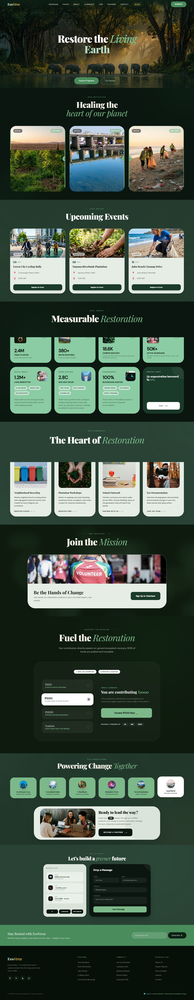

# 🌿 EcoVerse

EcoVerse is a modern, interactive platform dedicated to driving real-world environmental restoration. It empowers communities to organize, track, and participate in ecological initiatives like tree plantations, river restorations, and beach cleanups, all while providing transparent, measurable impact metrics.

*(Note: Please upload your screenshot collage as `collage.png` in the root directory)*

---

## ✨ Functionality & Features

- **Interactive Impact Sliders:** Visually compare before and after states of restoration sites using interactive sliders.
- **Dynamic Event Management:** Admins can effortlessly create, manage, and publish upcoming environmental drives (cleanups, cycling rallies, etc.) directly from the dashboard.
- **Volunteer Intake System:** A streamlined registration flow for volunteers to sign up for specific causes, complete with an Admin approval/rejection workflow.
- **Real-Time Impact Metrics:** Live statistics tracking total trees planted, carbon reduced, water restored, and total active guardians.
- **Environmental Journalism:** An integrated blog/story section dedicated to highlighting urgent climate crises (e.g., urban heatwaves) and inspiring conservation stories.
- **Immersive UI:** A premium, dark-themed interface built with React and Tailwind CSS, featuring glassmorphism and smooth reveal animations to keep users engaged.

---

## 🌍 The Problem We Are Solving

We are facing unprecedented global climate emergencies, from extreme heatwaves to severe biodiversity loss. While many individuals want to help, they often face significant barriers:
1. **Lack of Centralization:** It's difficult for people to find localized, credible environmental drives to join.
2. **Invisible Impact:** Volunteers and donors rarely get to see the tangible, long-term results of their contributions.
3. **Inefficient Organization:** Community leaders and NGOs struggle to manage volunteers and events through scattered spreadsheets and social media groups.

**EcoVerse bridges the gap between intention and measurable action.**

---

## 🚀 How We Are Different

Unlike traditional NGO websites or generic event directories, EcoVerse is built specifically as an **action-oriented ecosystem**:

1. **Visual Accountability:** Instead of just listing numbers, we use interactive visual evidence (Before/After sliders) to show the literal transformation of the environment, proving that the work actually matters.
2. **End-to-End Workflow:** We provide a single hub for everything—from the moment a volunteer reads an inspiring blog post, to signing up for a specific local drive, to the organizers managing that intake on a secure dashboard.
3. **Focus on Transparency:** Our architecture is designed around "Measurable Restoration", emphasizing verifiable metrics (like Blockchain Audited tracking concepts) to ensure corporate and community accountability.
4. **Engagement Through Design:** We treat environmentalism with the modern, premium web aesthetic it deserves. By moving away from outdated, clunky layouts to an immersive, animated experience, we attract a younger, tech-savvy generation of volunteers.

---

## 🛠️ Tech Stack

- **Frontend:** React, TypeScript, Vite
- **Styling:** Tailwind CSS (v4)
- **Backend/Database:** Firebase Firestore (Events, Volunteers, Registrations)
- **Icons & Animations:** Lucide React, Framer Motion
